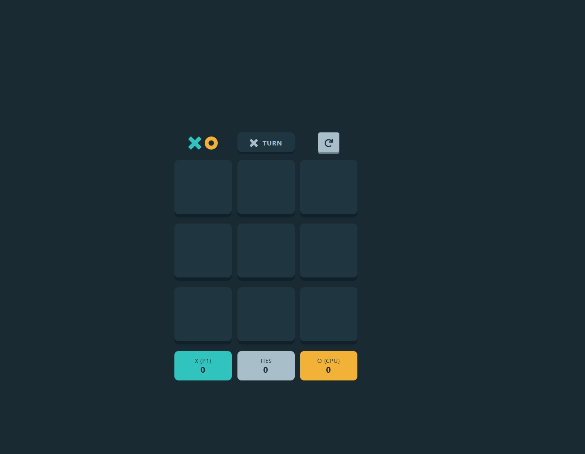
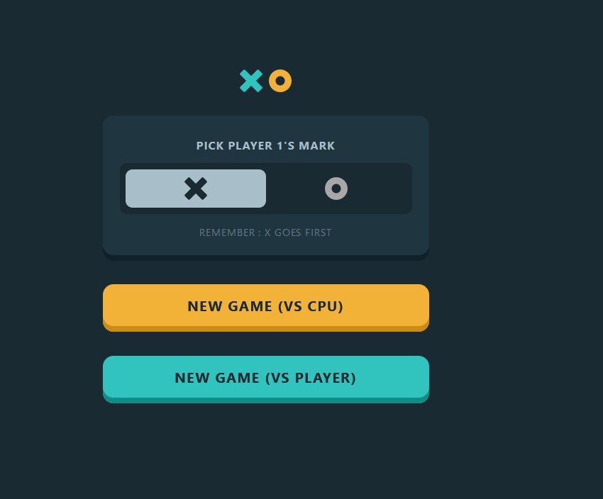

# Frontend Mentor - Tic Tac Toe solution

This is a solution to the [Tic Tac Toe challenge on Frontend Mentor](https://www.frontendmentor.io/challenges/tic-tac-toe-game-Re7ZF_E2v). Frontend Mentor challenges help you improve your coding skills by building realistic projects.

## Table of contents

- [Overview](#overview)
  - [The challenge](#the-challenge)
  - [Screenshot](#screenshot)
  - [Links](#links)
- [My process](#my-process)
  - [Built with](#built-with)
- [Author](#author)

## Overview

### The challenge

Users should be able to:

- View the optimal layout for the game depending on their device's screen size
- See hover states for all interactive elements on the page
- Play the game either solo vs the computer or multiplayer against another person
- **Bonus 1**: Save the game state in the browser so that it’s preserved if the player refreshes their browser
- **Bonus 2**: Instead of having the computer randomly make their moves, try making it clever so it’s proactive in blocking your moves and trying to win

### Screenshot

### Links

- Solution URL: [solution](https://www.frontendmentor.io/solutions/tictactoeapp-nextjs13reactjststailwindcsszustand-obFoKax9Aq)
- Live Site URL: [live site](https://tic-tac-toe-app-lorenzoaniel.vercel.app/)

## My process

### Built with

- Semantic HTML5 markup
- Flexbox
- CSS Grid
- Mobile-first workflow
- [Zustand](https://zustand-demo.pmnd.rs/) - React global state management library
- [React](https://reactjs.org/) - JS library
- [Next.js](https://nextjs.org/) - React framework
- [TailWindCSS](https://tailwindcss.com/) - For styles/animations

## Author

- Website - [Mikhail Lorenzo Aniel](https://www.mikhaillorenzoaniel.com/)
- Frontend Mentor - [@lorenzoaniel](https://www.frontendmentor.io/profile/lorenzoaniel)
- LinkedIn - [Mikhail Lorenzo Aniel](https://www.linkedin.com/in/mikhail-lorenzo-aniel-283022127/)
